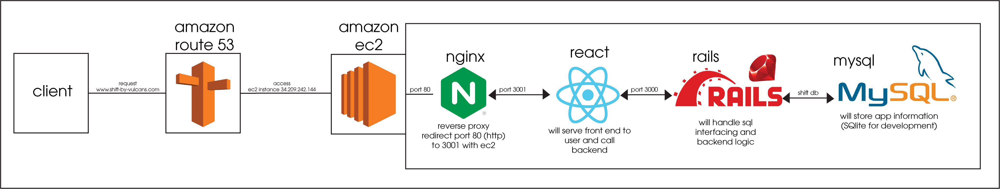
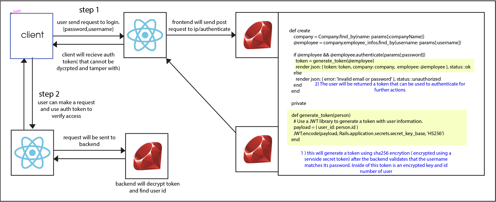

# Shift #

# Description #
The team members collaborating on this project are Austin Pace,
Axell Martinez, Bailey Dalton, William Cessor, and Michael Boynton.
We are creating a mobile application to track employee attendance and will
include other features such as ability to set own schedule, see your 
paycheck in advance and a user profile to keep track of employees.
This application is meant for small buisness owners as a way 
to track hours worked of employees. We are creating this application
to improve effieceny and accuarcy of companies.

# General Info #

# Technologies #

1. Aws route53,
2. Aws ec2,
3. nginx,
4. React,
5. CSS,
6. JavaScript,
7. Firebase,
8. Ruby on rails,
9. Mysql and SQlite
10. JWT

# Features #
*User profile: This feature will be the first implementation to our app. 
It will be intended for both employees and employers as a way to store
personal information stored by the company

# Contributions #
* Axell "worked on setting up technologies and connecting backend to frontend"
    * created api calls from rails to react 
      * reference-https://cs3398f23vulcans.atlassian.net/jira/software/projects/SCRUM/boards/1?selectedIssue=SCRUM-32
    * created user auth using jwt
      * reference-https://cs3398f23vulcans.atlassian.net/jira/software/projects/SCRUM/boards/1?selectedIssue=SCRUM-57

# Next Steps #

* Axell
  * Create mobile view and add task to employees