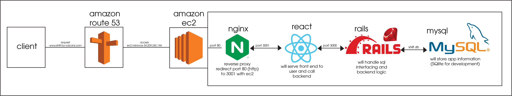
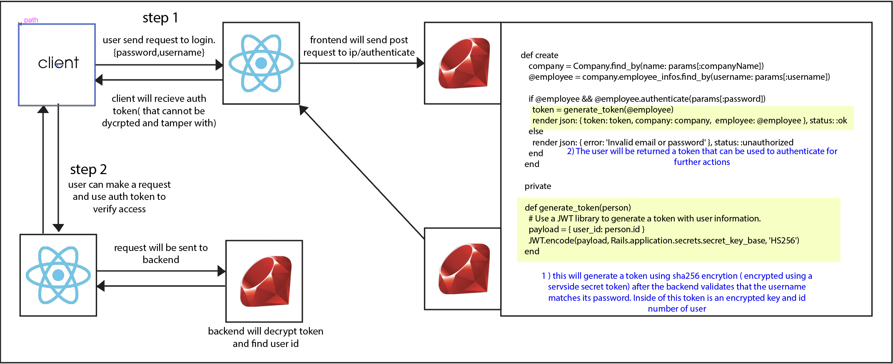
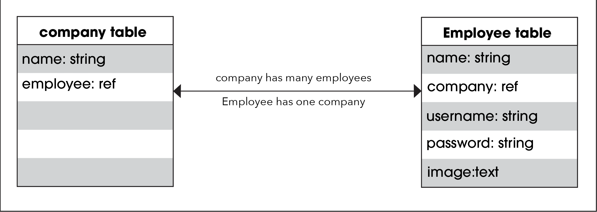

# Shift #

# Description #
The team members collaborating on this project are Austin Pace,
Axell Martinez, Bailey Dalton, William Cessor, and Michael Boynton.
We are creating a mobile application to track employee attendance and will
include other features such as ability to set own schedule, see your 
paycheck in advance and a user profile to keep track of employees.
This application is meant for small buisness owners as a way 
to track hours worked of employees. We are creating this application
to improve effieceny and accuarcy of companies.

# General Info #

# Technologies #

1. Aws route53,
2. Aws ec2,
3. nginx,
4. React,
5. CSS,
6. JavaScript,
7. Firebase,
8. Ruby on rails,
9. Mysql and SQlite
10. JWT

# Features #
*User profile: This feature will be the first implementation to our app. 
It will be intended for both employees and employers as a way to store
personal information stored by the company

# Contributions #
* Axell "worked on setting up technologies and connecting backend to frontend"
  * Sprint 1
    * created api calls from rails to react         
      * reference-https://cs3398f23vulcans.atlassian.net/jira/software/projects/SCRUM/boards/1?selectedIssue=SCRUM-32
    * created user auth using jwt
      * reference-https://cs3398f23vulcans.atlassian.net/jira/software/projects/SCRUM/boards/1?selectedIssue=SCRUM-57
  * Sprint 2
    * Refactored code base, focused on creating employee and company classes where instances can interact with backend api with method such as employee.addToCompany
      * reference-https://bitbucket.org/cs3398f23vulcans/%7B015458a2-8e6c-47ed-83e7-54ca69705a83%7D/pull-requests/60
    * Added submenu to employee tast that contains several actions such as delete, make admin and delete
      * reference-https://bitbucket.org/cs3398f23vulcans/%7B015458a2-8e6c-47ed-83e7-54ca69705a83%7D/pull-requests/61
* Austin "Worked mostly on frontend visuals and research about the technologies being used"
* Sprint 1
    * Created skeleton react app with basic funstion that we have been building off of
        * Referance URL - https://cs3398f23vulcans.atlassian.net/jira/software/projects/SCRUM/boards/1/backlog?selectedIssue=SCRUM-34
        "ABOVE IS MISLABELED ON GIT KRACKEN AND JUST SAYS SKELETON UI WITH MY NET ID"
    * Conducted research on multiple technologies
        * Reference URL-https://cs3398f23vulcans.atlassian.net/jira/software/projects/SCRUM/boards/1/backlog?selectedIssue=SCRUM-42
        * Reference URL-https://cs3398f23vulcans.atlassian.net/jira/software/projects/SCRUM/boards/1/backlog?selectedIssue=SCRUM-29
* Sprint 2 
    " Worked on backend attributes of employees and frontend features that utilizes them.
    * Assign Employees a position/title
       * https://cs3398f23vulcans.atlassian.net/jira/software/projects/SCRUM/boards/1?selectedIssue=SCRUM-93
       * https://bitbucket.org/cs3398f23vulcans/shift/pull-requests/52
    * Add Position field when creating Employee
      * https://cs3398f23vulcans.atlassian.net/jira/software/projects/SCRUM/boards/1?selectedIssue=SCRUM-107
      * https://bitbucket.org/cs3398f23vulcans/shift/pull-requests/64
    * Have position show on employee card/Have position update when created
      * https://cs3398f23vulcans.atlassian.net/jira/software/projects/SCRUM/boards/1?selectedIssue=SCRUM-80
      * https://bitbucket.org/cs3398f23vulcans/shift/pull-requests/71
    * Make a mobile view (work with Bailey)
      * https://cs3398f23vulcans.atlassian.net/jira/software/projects/SCRUM/boards/1?selectedIssue=SCRUM-75
      * https://bitbucket.org/cs3398f23vulcans/%7B015458a2-8e6c-47ed-83e7-54ca69705a83%7D/pull-requests/72
* Sprint 2
    * Bailey "Worked on the ability to change features on the front end and update them on the backend."
        * Fix up the Clock In or Clock out option when viewing Employees SCRUM-94
          * https://cs3398f23vulcans.atlassian.net/jira/software/projects/SCRUM/boards/1?selectedIssue=SCRUM-94
          * https://bitbucket.org/cs3398f23vulcans/%7B015458a2-8e6c-47ed-83e7-54ca69705a83%7D/pull-requests/45
        * Make Mobile View work with Austin SCRUM-89
          * https://cs3398f23vulcans.atlassian.net/jira/software/projects/SCRUM/boards/1?selectedIssue=SCRUM-89
          * https://bitbucket.org/cs3398f23vulcans/%7B015458a2-8e6c-47ed-83e7-54ca69705a83%7D/pull-requests/72
        * Add ClockIn/Clockout Fuctionality SCRUM-77
          * https://cs3398f23vulcans.atlassian.net/jira/software/projects/SCRUM/boards/1?selectedIssue=SCRUM-77
          * https://bitbucket.org/cs3398f23vulcans/%7B015458a2-8e6c-47ed-83e7-54ca69705a83%7D/pull-requests/55
        * Add modal or popup screen to employee list ( can be side bar on left side additional to the one on the right ) SCRUM-74
          * https://cs3398f23vulcans.atlassian.net/jira/software/projects/SCRUM/boards/1?selectedIssue=SCRUM-74
          * https://bitbucket.org/cs3398f23vulcans/%7B015458a2-8e6c-47ed-83e7-54ca69705a83%7D/pull-requests/59
        * Add Admin status change for employees SCRUM-101
          * https://cs3398f23vulcans.atlassian.net/jira/software/projects/SCRUM/boards/1?selectedIssue=SCRUM-101
          * https://bitbucket.org/cs3398f23vulcans/%7B015458a2-8e6c-47ed-83e7-54ca69705a83%7D/pull-requests/56
          
* Michael "Worked primarily on gettig a functiion settings tab acessible for users."
  * Sprint 2
    * Assigned employees a 'pay' attribute.
      * https://bitbucket.org/cs3398f23vulcans/shift/pull-requests/57
    * Started working on the 'Settings' tab in our app - give users the ability to change password
      * https://bitbucket.org/cs3398f23vulcans/shift/pull-requests/70

# Next Steps #
* Bailey
  * Continue to reformat everything into a mobile view
* Axell
  * Sprint 1
    * Create mobile view and add task to employees
  * Sprint 2
    * deploy on aws possibly using CD/CI
* Austin
  * Sprint 1
    * work on mobile view Clock in and out function
  * Sprint 2
    * Assist with mobile view
    * Possibly work on additional features.
* Michael 
  * Continue adding functions to settings tab
  * Work with team to start deploying on AWS
  * Fix runtime error that became present during demo